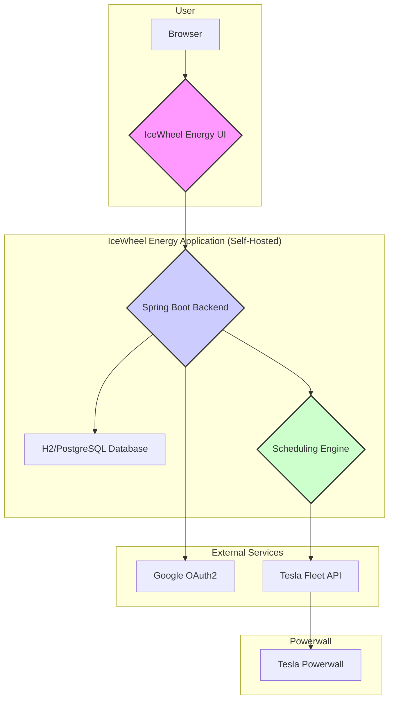

# Architecture Overview

This document provides a high-level overview of the IceWheel Energy application's architecture.

## Technology Stack

* **Backend**: Spring Boot 3 (Java 24)
* **Frontend**: Thymeleaf, Bootstrap 5, JavaScript
* **Database**: H2 (for development), PostgreSQL (for production)
* **Authentication**: Spring Security with OAuth2 for Google SSO
* **Scheduling**: Spring's built-in scheduling with ShedLock for distributed lock management
* **Build Tool**: Maven
* **Deployment**: Docker

## Architecture Diagram

The following diagram illustrates the high-level architecture of the application:

### Components

* **IceWheel Energy UI**: The web-based user interface that users interact with to manage their schedules.
* **Spring Boot Backend**: The core of the application. It handles user authentication, serves the UI, and provides a
  REST API for managing schedules.
* **Database**: Stores user information, schedules, and execution history.
* **Scheduling Engine**: The heart of the application's automation. It is responsible for executing schedules and
  reconciling the Powerwall's state.
* **Google OAuth2**: Used for user authentication, allowing users to log in with their Google accounts.
* **Tesla Fleet API**: The official Tesla API used to communicate with the Powerwall.
* **Tesla Powerwall**: The user's home battery storage system.

## Design Principles

* **Privacy First**: The application is designed to be self-hosted, giving users full control over their data.
* **Simplicity**: The architecture is kept as simple as possible to make it easy to understand, deploy, and maintain.
* **Resilience**: The application includes self-healing mechanisms like the `PowerwallStateReconciler` to ensure that
  the Powerwall's state is always in sync with the user's desired schedule, even in the event of temporary failures or
  application downtime.
* **Extensibility**: The modular design allows for future extensions and integrations.
