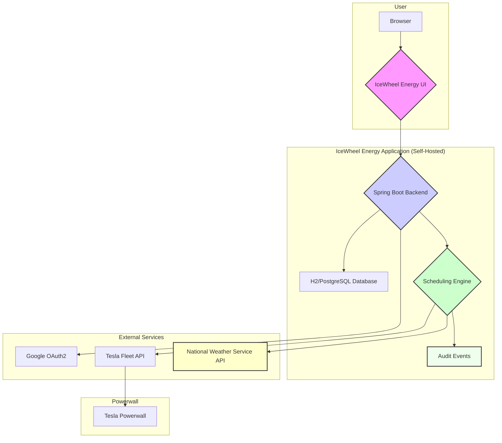

# Architecture Overview

This document provides a high-level overview of the IceWheel Energy application's architecture.

## Technology Stack

* **Backend**: Spring Boot 3 (Java 24)
* **Frontend**: Thymeleaf, Bootstrap 5, JavaScript
* **Database**: H2 (for test cases), PostgreSQL (for production)
* **Authentication**: Spring Security with OAuth2 for Google SSO
* **Scheduling**: Spring Scheduling + ShedLock for distributed lock management
* **Weather Integration**: National Weather Service (NWS) via Spring RestClient/RestTemplate and an OpenAPI-generated client; custom evaluator to derive a solar forecast
* **Build Tool**: Maven
* **Deployment**: Java/JVM App, Docker, Kubernetes

## Architecture Diagram

The following diagram illustrates the high-level architecture of the application, including weather‑aware scheduling:

```mermaid
graph TD
    subgraph User
        A[Browser] --> B{IceWheel Energy UI}
    end

    subgraph "IceWheel Energy Application (Self-Hosted)"
        B --> C{Spring Boot Backend}
        C --> D[H2/PostgreSQL Database]
        C --> E{Scheduling Engine}
        E --> J[Audit Events]
    end

    subgraph "External Services"
        C --> F[Google OAuth2]
        E --> G[Tesla Fleet API]
        E --> I[National Weather Service API]
    end

    subgraph Powerwall
        G --> H[Tesla Powerwall]
    end

    style B fill:#f9f,stroke:#333,stroke-width:2px
    style C fill:#ccf,stroke:#333,stroke-width:2px
    style E fill:#cfc,stroke:#333,stroke-width:2px
    style I fill:#ffc,stroke:#333,stroke-width:2px
    style J fill:#efe,stroke:#333,stroke-width:2px
```

### Components

* **IceWheel Energy UI**: The web-based user interface that users interact with to manage their schedules.
* **Spring Boot Backend**: The core of the application. It handles user authentication, serves the UI, and provides a REST API for managing schedules.
* **Database**: Stores user information, schedules, audit events, and execution history.
* **Scheduling Engine**: The application's automation layer. It includes:
  * `PowerwallScheduleExecutor` — executes due schedules precisely.
  * `PowerwallStateReconciler` — the "enforcer" that self-heals the Powerwall state every few minutes.
  * `WeatherAwareScheduler` — the "planner" that evaluates weather and injects temporary charge/discharge schedules when poor solar is predicted.
* **Weather Module**: Fetches and evaluates weather data.
  * `WeatherService` integrates with the NWS API (see `RestClientConfig`) and prepares processed forecast data per user/location.
  * `WeatherForecastEvaluator` synthesizes a "sunshine percentage" and rationale used by the planner.
* **Audit Trail**: Key decisions and updates are recorded as `ScheduleAuditEvent`s and shown in the Change History UI.
* **Google OAuth2**: Used for user authentication, allowing users to log in with their Google accounts.
* **Tesla Fleet API**: The official Tesla API used to communicate with the Powerwall.
* **Tesla Powerwall**: The user's home battery storage system.

### Weather‑Aware Scheduling at a Glance

* Runs on a configurable cron (`app.weather-check.cron`, defaults to hourly) when off‑peak.
* Evaluates forecast for the user’s location to compute a "solar shortfall" (100 − sunshine%).
* If shortfall is significant, creates temporary schedules to pre‑charge from the grid before the next on‑peak window, respecting user caps and scaling.
* All reasoning is logged into schedule evaluation details and the audit trail; enforcement is still done by the `PowerwallStateReconciler`.

See also: `docs/architecture/scheduling.md` for a deeper dive into execution and reconciliation.

## Design Principles

* **Privacy First**: The application is designed to be self-hosted, giving users full control over their data.
* **Simplicity**: The architecture is kept as simple as possible to make it easy to understand, deploy, and maintain.
* **Resilience**: The application includes self-healing mechanisms like the `PowerwallStateReconciler` to ensure that the Powerwall's state is always in sync with the user's desired schedule, even in the event of temporary failures or application downtime.
* **Extensibility**: The modular design allows for future extensions and integrations, including additional forecast providers or planning strategies.
